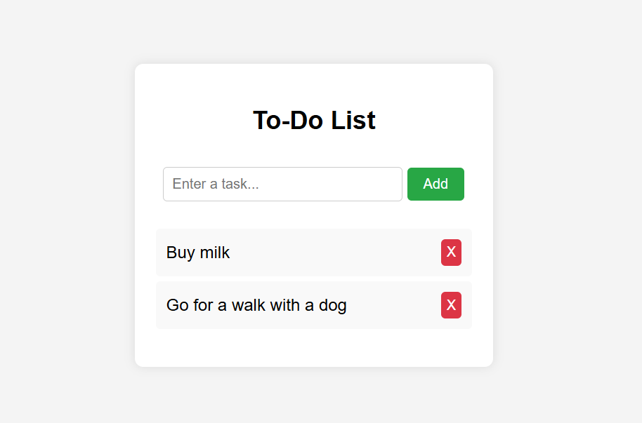

# 📝 To-Do List App

A simple and responsive **To-Do List application** built with **HTML, CSS, and JavaScript**.  
This project allows users to add, display, and delete tasks with a clean and minimal user interface.  

> This project was created as part of my **JavaScript learning journey** to practice working with HTML, CSS, and vanilla JS.
---

## Features
- Add new tasks  
- Delete tasks with one click  
- Keeps tasks neatly organised in a list  
- Simple and responsive design  

---

## Tech Stack
- **HTML5** – structure of the app  
- **CSS3** – styling and layout  
- **JavaScript (Vanilla JS)** – app logic for adding and removing tasks  

---

## Project Structure
```plaintext
index.html    # Main HTML structure
style.css     # Styling for the app
script.js     # JavaScript functionality
```
---
## How to Run

1. Clone or download this repository.
2. Open index.html in your browser.
3. Start adding and managing tasks!
---

## Screenshot
  

---

## License
This project is for **educational and portfolio purposes**.  
